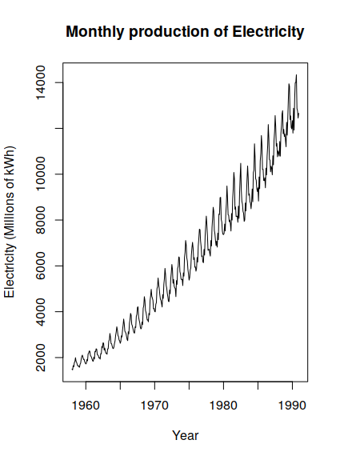
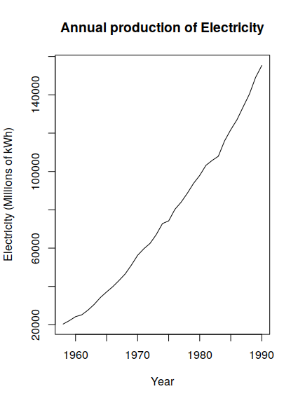
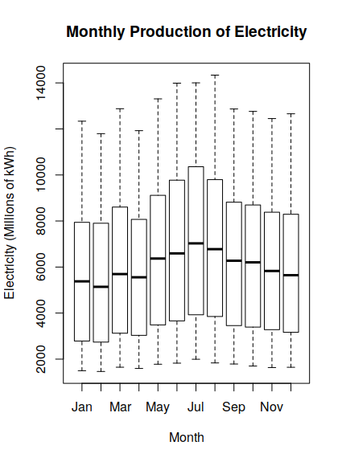
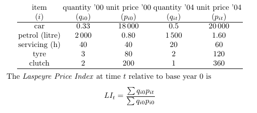

# HW Already Due

SN 1-4

## Chapter 1

### 1. Carry out the following exploratory time series analysis in R using either the chocolate or the beer production data from §1.4.3.

#### a) Produce a time plot of the data. Plot the aggregated annual series and a boxplot that summarises the observed values for each season, and comment on the plots.






#### b) Decompose the series into the components trend, seasonal effect, and residuals, and plot the decomposed series. Produce a plot of the trend with a superimposed seasonal effect.

### 2. Many economic time series are based on indices. A price index is the ratio of the cost of a basket of goods now to its cost in some base year. In the Laspeyre formulation, the basket is based on typical purchases in the base year. You are asked to calculate an index of motoring cost from the following data. The clutch represents all mechanical parts, and the quantity allows for this.


#### Calculate the LIt for 2004 relative to 2000.

first the data 
```R
carconomics<-cbind(c(.33,2000,40,3,2),c(18000,.8,40,80,200),c(.5,1500,20,2,1),c(20000,1.6,60,120,360))

colnames(carconomics)<-c("quantity '00 (qi0)", " unit price '00(pi0)", " quantity '04(qit)", "unit price '04 (pit)")

rownames(carconomics)<-c("car","petrol (litre)", "servicing(h)", "tyre","clutch")
```

'''
               quantity '00 (qi0)  unit price '00(pi0)  quantity '04(qit) unit price '04 (pit)
car                          0.33              18000.0                0.5              20000.0
petrol (litre)            2000.00                  0.8             1500.0                  1.6
servicing(h)                40.00                 40.0               20.0                 60.0
tyre                         3.00                 80.0                2.0                120.0
clutch                       2.00                200.0                1.0                360.0

'''

## CM Ch. 5

### 3. This question is based on the electricity production series (1958–1990).

#### a) Give two reasons why a log-transformation may be appropriate for the electricity series.

#### b) Fit a seasonal indicator model with a quadratic trend to the (natural) logarithm of the series. Use stepwise regression to select the best model based on the AIC.

#### c) Fit a harmonic model with a quadratic trend to the logarithm of the series. Use stepwise regression to select the best model based on the AIC.

#### d) Plot the correlogram and partial correlogram of the residuals from the overall best-fitting model and comment on the plots.

#### e) Fit an AR model to the residuals of the best-fitting model. Give the order of the best-fitting AR model and the estimated model parameters.

#### f) Plot the correlogram of the residuals of the AR model, and comment.

#### g) Write down in full the equation of the best-fitting model.

#### h) Use the best fitting model to forecast electricity production for the years 1991–2000, making sure you have corrected for any bias due to taking logs.
